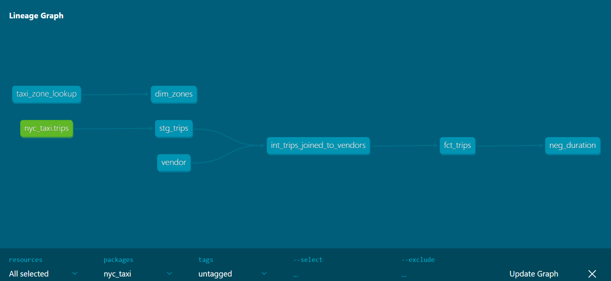

# NYC Taxi Analytics — dbt + DuckDB

A small but production-shaped analytics pipeline that transforms raw NYC TLC yellow-taxi
trip records (Parquet) into a tested, query-ready star schema using
[dbt](https://www.getdbt.com/) and [DuckDB](https://duckdb.org/) — no cloud warehouse required.

> Built to learn dbt hands-on, coming from 4+ years of Airflow / SQL pipeline work.

## What it does

- Reads monthly NYC TLC yellow-taxi Parquet files directly with DuckDB — no load step.
- Cleans and standardizes them, models them into a star schema, and validates them with a suite of dbt tests.
- Builds the central fact table **incrementally, one month at a time**, using dbt's `microbatch` strategy.

## Architecture

```
sources (Parquet) → staging → intermediate → marts
```


<!-- Add the screenshot: run `dbt docs serve`, open the lineage graph (bottom-right icon), and save it to docs/lineage.png -->

| Layer | Model | Purpose |
|---|---|---|
| staging | `stg_trips` | Rename raw columns, decode rate-code & payment-type enums; kept 1:1 with the source |
| intermediate | `int_trips_joined_to_vendors` | Join the vendor lookup and apply data-quality filters |
| marts (dim) | `dim_zones` | Pickup/dropoff zone dimension, from the TLC zone-lookup seed |
| marts (fact) | `fct_trips` | One row per trip; incremental microbatch fact |

Seeds: `taxi_zone_lookup` (→ `dim_zones`) and `vendor` — a small, version-controlled
code→name lookup, chosen as a seed because the vendor set grows over time.

## Data model & design decisions

- **Star schema.** `fct_trips` (measures + foreign keys) joins `dim_zones` for both pickup
  and dropoff — a role-playing dimension. Vendor, rate code, and payment type are treated as
  **decoded enums**, not dimensions: a two-column code→label lookup doesn't earn its own table.
- **Grain.** One row per trip.
- **No natural primary key.** TLC trips carry no trip id, so idempotency is managed at the
  **month** grain rather than a fragile row-level surrogate key.
- **Layer discipline.** Staging is a faithful, 1:1 mirror of the source (rename/cast/decode only);
  all joins and row filtering happen in the intermediate layer.

## Incremental strategy (microbatch)

`fct_trips` uses dbt's `microbatch` strategy:

```python
materialized='incremental', incremental_strategy='microbatch',
event_time='pickup_datetime', batch_size='month',
lookback=3, full_refresh=false
```

- Each **month is its own batch**, built and replaced atomically.
- `lookback=3` reprocesses the trailing three months on every run, so TLC's ~2-month
  publication lag and its month-level restatements are absorbed automatically.
- Because there is no row-level key, idempotency lives at the month/partition level — no
  surrogate-key guessing, and no `is_incremental()` high-watermark that would miss late restatements.

## Testing & data quality

- **Keys:** `unique` + `not_null` on `dim_zones.location_id` and the `vendor` seed key.
- **Referential integrity:** `relationships` tests confirm every pickup/dropoff location in
  `fct_trips` exists in `dim_zones`.
- **Source validity:** `accepted_values` on the raw `RatecodeID` / `payment_type` codes,
  tested at the source boundary (before decoding).
- **Custom generic test:** a reusable `non_negative` test applied to durations, distances, and fares.
- **Singular test:** `neg_duration` guarantees no trip ends before it starts.
- **Judgment over dogma:** ~115k negative fares are legitimate TLC refunds/disputes, so
  `fare_amount` is `severity: warn` — surfaced and monitored, not failed. Trip *duration*,
  which genuinely cannot be negative, stays `error`.

Data-quality filters (dropoff ≥ pickup, plausible pickup date) live in the intermediate layer,
keeping staging a faithful mirror of the source.

## Run it locally

```bash
git clone <repo-url>
cd dbt_nv
python3 -m venv .venv && source .venv/bin/activate
pip install -r requirements.txt

# 1. Download one or more monthly Parquet files into data/raw/, e.g.
#    yellow_tripdata_2026-05.parquet from
#    https://www.nyc.gov/site/tlc/about/tlc-trip-record-data.page

# 2. Point ~/.dbt/profiles.yml at a local DuckDB file (profile name: nyc_taxi)

dbt deps          # install dbt packages (if any)
dbt build         # seeds + models + tests
dbt docs serve    # browse the docs and lineage graph
```

Raw Parquet and the built DuckDB database are git-ignored — only the code ships.

## Project structure

```
models/
  staging/        stg_trips (+ source & staging tests)
  intermediate/   int_trips_joined_to_vendors
  marts/          dim_zones, fct_trips (+ marts tests)
seeds/            taxi_zone_lookup.csv, vendor.csv
tests/            neg_duration.sql          (singular test)
tests/generic/    non_negative.sql          (custom generic test)
```

## Roadmap

The core pipeline — staging → marts, incremental fact, and tests — is complete. Planned next:

- **Analytical / aggregate marts** (revenue and trips by zone, by hour of day).
- A **reusable macro** and an **`on-run-end` hook** that logs run results, for observability.
- **CI:** a GitHub Actions workflow running `dbt build` + `dbt test` on every pull request.

---

Stack: dbt Core 1.11 · dbt-duckdb · DuckDB · NYC TLC yellow-taxi Parquet.
